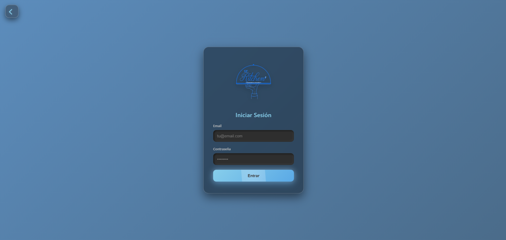

# 🍽️ Sr. Kitchen 

[](https://www.java.com)
[](https://spring.io/projects/spring-boot)
[](https://www.mongodb.com)
[](https://www.docker.com)
[](https://developer.mozilla.org/es/docs/Web/HTML)
[](https://developer.mozilla.org/es/docs/Web/CSS)

## 📋 Descripción

**Sr. Kitchen** es un **aplicativo web** desarrollado para optimizar la gestión operativa de restaurantes de pequeña y mediana escala. Centraliza y automatiza el control de **compras**, **ventas**, **inventarios** y generación de **reportes financieros**, reemplazando procesos manuales propensos a errores y permitiendo una toma de decisiones más rápida y basada en datos.

El sistema integra tecnologías modernas y escalables: backend robusto en **Java + Spring Boot**, base de datos flexible **MongoDB**, frontend intuitivo con **HTML/CSS + framework moderno** y despliegue portable mediante **Docker**.


**Autores:**
- Camilo Andrés Martínez Peña
- Jesús David Caldera Baldovino
- Carlos Andrés Ruiz Herrera
- Jose Manuel Ayola Arbeláez

## ✨ Características principales

- Gestión completa de **productos** e **ingredientes** (CRUD)
- Registro y seguimiento automático de **pedidos** con cambio de estados
- Control de **inventario** en tiempo real con alertas de stock bajo
- Registro de **compras** y **ventas** con actualización automática de existencias
- Dashboard con indicadores clave (ventas, ingresos, productos más vendidos)
- Generación de **reportes** financieros y operativos
- Asignación de **roles y permisos** diferenciados (Administrador / Mesero)
- Interfaz gráfica **intuitiva** y responsive
- Despliegue simplificado con **Docker** y **Docker Compose**
- (En desarrollo / futuro) Pronóstico de demanda y recomendaciones personalizadas

## 🛠️ Tecnologías utilizadas

| Capa              | Tecnología                          | Propósito                              |
|-------------------|-------------------------------------|----------------------------------------|
| Backend           | Java 17+, Spring Boot               | Lógica de negocio, API REST            |
| Base de datos     | MongoDB                             | Almacenamiento flexible y escalable    |
| Frontend          | HTML5, CSS3, JavaScript + framework | Interfaz de usuario moderna e intuitiva|
| Contenerización   | Docker, Docker Compose              | Portabilidad y despliegue sencillo     |
| Construcción      | Maven                               | Gestión de dependencias y empaquetado  |
| Reportes / análisis | (Integración futura con R / Python) | Análisis avanzado |

## 🖼️ Capturas de pantalla

Actualmente disponibles:

- **Dashboard principal**  
  

- **Login**  
  

## 🚀 Cómo ejecutar el proyecto

### Opción 1: Usando Docker (recomendado)

1. Clona el repositorio
   ```bash
   git clone https://github.com/camilo19p/Sr.-Kitchen.git
   cd Sr.-Kitchen

📜 Licencia y Derechos de Autor
© 2025–2026 Camilo Andrés Martínez Peña y colaboradores
Todos los derechos reservados.
Este software (código fuente, ejecutables, documentación, capturas y recursos asociados) está protegido por derechos de autor.
Está prohibido (sin autorización escrita previa de los autores):

Copiar, reproducir, modificar o crear obras derivadas
Distribuir, publicar o subir a otros repositorios/plataformas
Usar con fines comerciales, institucionales o educativos sin permiso
Eliminar o alterar esta nota de derechos de autor

Para solicitar licencia, colaboración o permiso de uso, contacta a:
✉️ martinezcamilo25p@gmail.com
